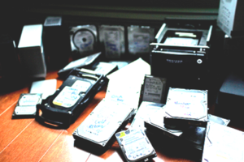
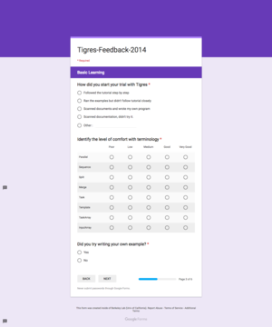
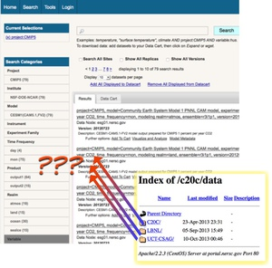

# Ten Principles for Creating Usable Scientific Systems

Lavanya Ramakrishnan,
*Usable Software Systems Group*, LBNL,
September 2016

## 1. Solve the right problem first

We were out to do some research on understanding next-generation big
data problems. We got together because there was mutual interest.
But what the user really had was an immense problem of data
management -- he was simply running out of space.

## 2. Understand user motivations

Many of us have seen screenshots similar to these where people have
complex processes to manage the software and scripts and data from
their simulations and effectively have metadata and provenance in
file names.

    
## 3. Understand the context of use

If we don't know where and how the scientists are collecting the
data, the system we build probably won't be useful.

## 4. Validate and verify what you have heard

One of the questions we often struggle with is dealing with the
chaos of user requirements and "what do they actually mean?". To
help clarify, we asked users to rate their feeling about the various
features, and asked them to rank them. The final heatmap
was revealing. It was far from what the computer engineers thought
they should prioritize, and it also showed that users were different
from each other.

    
## 5. Test before building; test after building

We did a "paper prototype" usability for an API, to get feedback
from our user on nomenclature and understand what our users valued
the most. After developing a product, we performed a second round of
usability study -- this time, to study the effectiveness of using
the API more thoroughly, and over a longer time period.

## 6.  Clean interfaces can't make up for bad design

If the user thinks in terms of hierarchies of organisms, or files,
it will be difficult to satisfy them with a flat design.

## 7. Build for the right user

"What would I do?" may be extremely misleading. You have to
continually ask yourself whether you are really modeling a real
user, or just targeting someone who is convenient for you to think
about (like yourself!)

## 8. Understand the user's metrics

When computer engineers think about porting codes to HPC, they tend
to think about performance of the codes. This is only one part of
the picture. When we talked to users, they consistently worried
about their own time -- time waiting to run, time debugging, etc. --
as the primary metric. If running on HPC is wasting too much of
their time, performance gains of the code itself are not
very important.

## 9. Cost / Benefit for the scientists is different from the developers

## 10. Be willing to iterate (early and often)

Needs change, process itself needs to be iterative. Time is of
essence in engagements. Might need to iterate over designs -- but
don’t aim for perfection either.

